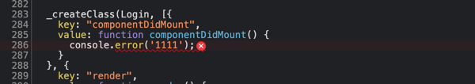
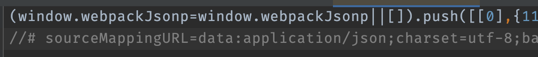
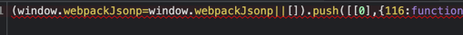

### 关键字

##### eval

    每个模块用eval执行，并且存在@sourceUrl，指向源文件

##### source-map

    会生成带有.map的文件，和源文件做一个映射，调试时根据.map文件定位原来代码的位置

##### cheap

    低消耗打包，就是打包的时候map文件不会保存原始代码的列位置信息，只包含行的位置

##### module

    加上在关键字，调试的代码不会被转换，会保留原始代码语法

### devtool（development环境）

#### 1.false

#### 2.eval

    每个模块用eval执行，构建快速，并且都有//@sourceURL，不能正确显示行数

#### 3.eval-source-map

    不会产生.map文件，多一个surceMappingURL，后面跟map文件的base64码，插入的
    bundle文件中。原始代码，没被转换

#### 4.cheap-eval-source-map

    同上，只是没有列信息

#### 5.cheap-module-eval-source-map

#### 6.source-map

#### 7.inline-source-map

    将.map转成base64插入到bundle中

#### 8.hidden-source-map

### 打包后的代码

    将所有生成的代码视为一大块代码，看不到相互分离的模块

### 生成后的代码

    每个模块相互分离，并用模块名进行注释，loader转义后的代码

### 原始代码

    每个模块相互分离，并用模块名进行注释，看到转义前的代码

### 无源代码内容

### devtool（正式环境）

false：压缩且一行显示

eval：映射到webpack转换过的代码(__webpack_require__(0))，不能正确的显示行数，代码没被压缩（console.error()）

source-map：原始代码，能看到整个项目的原始代码，因为会生成.map文件所以打包慢

cheap-source-map：同上，但是是babel转换过的代码，无法查看列信息

cheap-eval-source-map：相对于cheap-source-map，打包更快，因为没有.map文件

cheap-module-source-map：相对于cheap-source-map，因为能映射babel文件，能看见源代码

cheap-module-eval-source-map：包含cheap-eval-source-map和cheap-module-source-map

inline-source-map：同source-map，只不过不会生成.map文件，而是以base64（sourceMappingURL） 方式插入到bundle文件里，且很大

cheap-source-map：同source-map，但是不包含列信息，也不会有loader映射，故debug是转换后的代码

### webpack构建流程
    1、初始化参数：从配置文件和shell命令中读取与合并参数，返回最终的参数
    2、开始编译：用上一步得到的参数初始化Compiler对象，加载插件，执行对象的run方法开始编译
    3、缺点入口：根据配置文件的entry找到入口文件
    4、编译模块：从入口文件开始，调用Loader对模块进行编译，在找出依赖模块，在递归本步骤，知道所有的入口文件处理完成
    5、输出资源：根据入口和模块的依赖关系，组成一个个包含多个模块的chunk，再把每个chunk转换成一个单独的文件加入输出列表
    6、确定好输出内容后，根据配置文件确定输出的路径和文件名
    
    1、初始化：读取合并配置参数，初始化Compiler对象，同时加载插件
    2、编译：从入口文件开始（包括依赖），调用Loader进行编译
    3、将入口文件和依赖合并成一个chunk，将chunk转成文件，输出到文件系统
    
    tips：webpack在特定的时间点广播特定的事件，插件在收到通知后会执行特定的逻辑，并可以调用webpack的API改变运行结果

### 文件监听原理（watch）
    开启方式：1、在shell命令上加--watch参数；2、配置文件里设置watch:true
    原理：采用轮询方式判断文件最后更改时间，如果更新了，先换成起来，等watchOptions.aggregateTimeout后执行

### webpack热更新（HMR）原理
    本地文件发生变化后，webpack-dev-server通过websocket向浏览器推送更新（带有构建时的hash），让客户的与上一次做对比
    客户端对比有差异后会向webpack-dev-server发出ajax请求来获取更改列表，在使用jsonp获取chunk

### hash chunkHash contentHash
    hash：所有文件的hash值一样，只要改变内容，所有的hash都变，无法缓存
    
### 如何优化webpack构建速度
    1、升级webpack版本
    2、多进程构建（HappyPack(不维护了)、thread-loader）
    3、缩小打包范围（exclude/include，缩小loader规则范围）
    4、利用缓存（babel-loader、terser-webpack-plugin、cache-loader）

### webpack的作用
    1、兼容问题，对代码做polyfill，编译转换less、jsx，压缩，按需加载等
    
    
    

    
    

    

    
    
